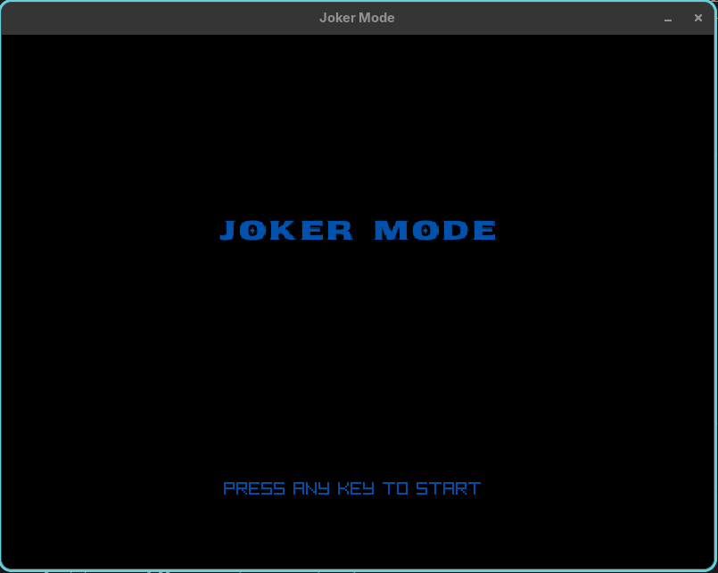
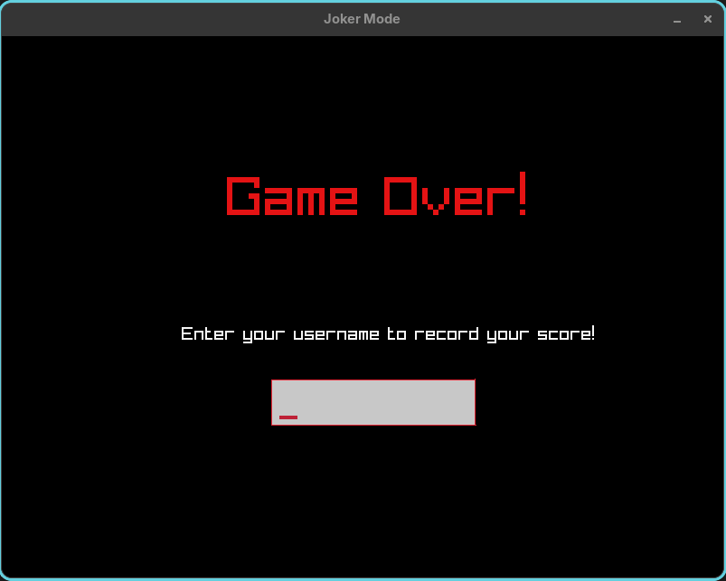
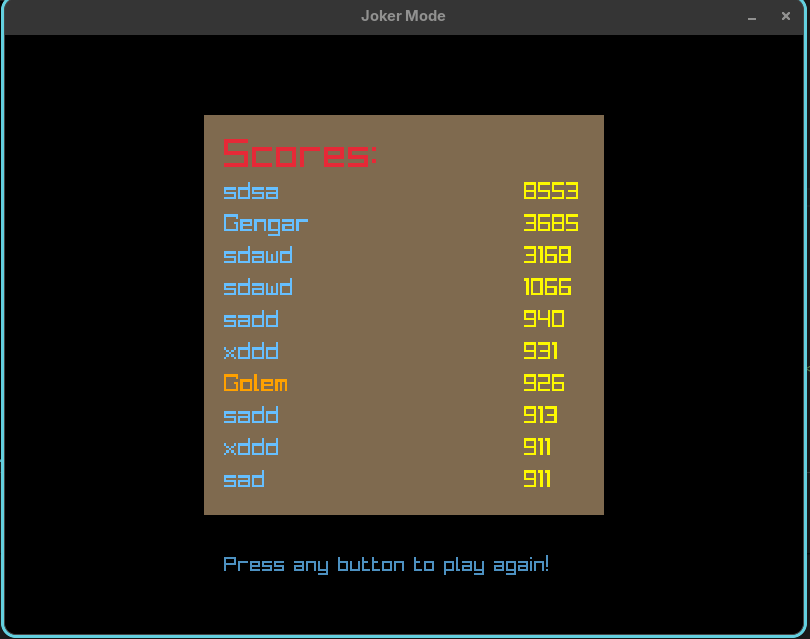

# The Vigilantes

A game about the slippery slope of punishing crime.

- Supports hot reloading: updating the code while it's still running!
- Supports hiscores to be posted to an HTTP server running a ESP32
- Everything is cross platform for Windows + Linux

Gameplay very much WIP.

~~Note that the hiscore server is down because I bricked my raspberry pi which was running it. Working on getting it back online.~~
The hiscore server is now running on an ESP32 which I hope is more robust. If you have a ESP32 yourself there are instructions for how to set up the server below.

By default the game tries to look for the hiscore server on localhost. You can point it to the actual hiscore server by setting the following env variables:

```bash
export SOCHISCORE_HOST="sochiscore.duckdns.org"
export SOCHISCORE_PORT=49944
export SOCHISCORE_ENDPOINT="/hiscores"
```

# Building on Windows

Prerequisites:
- CMake
- Visual Studio (or build tools for MSVC that CMake can detect)
- Windows SDK (Usually installed with Visual Studio)

If you have visual studio installed, you can enter the dev environment by executing the following script:

```
enter_dev.bat
```

After entering the windows dev env with the above script or using another method (any terminal with the msvc dev environment sourced should be okay), you can use the following build script:

```
build.bat <debug|release>
```

Once you have built once successfully `.\unity_build\build_windows.bat` can be run to rebuild the game dll: soc.dll. This is much faster than CMake Visual Studio generator (because it needs to generate lots of VS slop files) and slightly faster than CMake Ninja because it only has to compile a single file. The goal here was to make hot-reloading near instant.

# Building on Linux
Prerequisites:
- CMake
- make
- Working C compiler (that CMake can detect)

```
build.sh <debug|release>
```

Similarly to windows, soc.dll can be built with unity build via `.\unity_build\build_linux.sh`.

# Building via CMake

The above build.sh and build.bat scripts are just wrappers for cmake. You can invoke cmake directly to build.

Prerequisites:
- CMake
- A build generator for your platform (e.g. make, Ninja, Visual Studio)
- Working C compiler (that CMake can detect)

```
mkdir build
cd build
cmake -DCMAKE_BUILD_TYPE=Debug ..
cmake --build .
```

# Building for Android

Prerequisites:
- CMake
- Android NDK (set `ANDROID_NDK_HOME` to its location)
- Android SDK build-tools + a platform (for `aapt2`, `zipalign`, `apksigner`) and a JDK (for `keytool`)

```
build.sh release-android
```

This produces `dist/libsociety.so`. To package it into an installable APK:

```
cd android_packaging
./package_apk.sh
```

This signs with a debug keystore (generated on first run) and outputs `android_packaging/society-debug.apk`, installable via `adb install -r android_packaging/society-debug.apk`.

Note: hot reloading isn't available on Android, since the game code is statically linked into the same .so as the entry point.

# Hot reloading
As long as the data structures have not changed, hot reloading should work by executing the build commands while the
program is running. Try it by looking for the title screen text and changing it, saving and compiling while the game is still running!

# Setting up the ESP32 web server

Prerequisites:
- Platform IO vscode extension
- Some understanding of how to use Platform IO
- A duckdns domain

The ESP32 web server is located under the hiscore_server/ subdirectory. Open this directory as a platform IO project. I tested this with a Devkit v1 ESP32. As long as it's a ESP32 it should work though!

Create a subdirectory in this project called data/ and place two text files in it: config.txt and hiscores.bin. hiscores.bin you can leave empty and config.txt must be in the following format:

```
{WIFI_SSID}
{WIFI_PASSWORD}
{DUCKDNS_URL}
```

Where DUCKDNS_URL is the url that is used to update the IP of your duckdns domain.

Now you're good to build and upload the filesystem and application.

On the game side there's two defines that you need to change:
```
#define HISCORE_SERVER_HOST
#define HISCORE_SERVER_PORT
```
These should be self explanatory.

And you're done!

# Example Screenshots





# TODO
see TODO.md